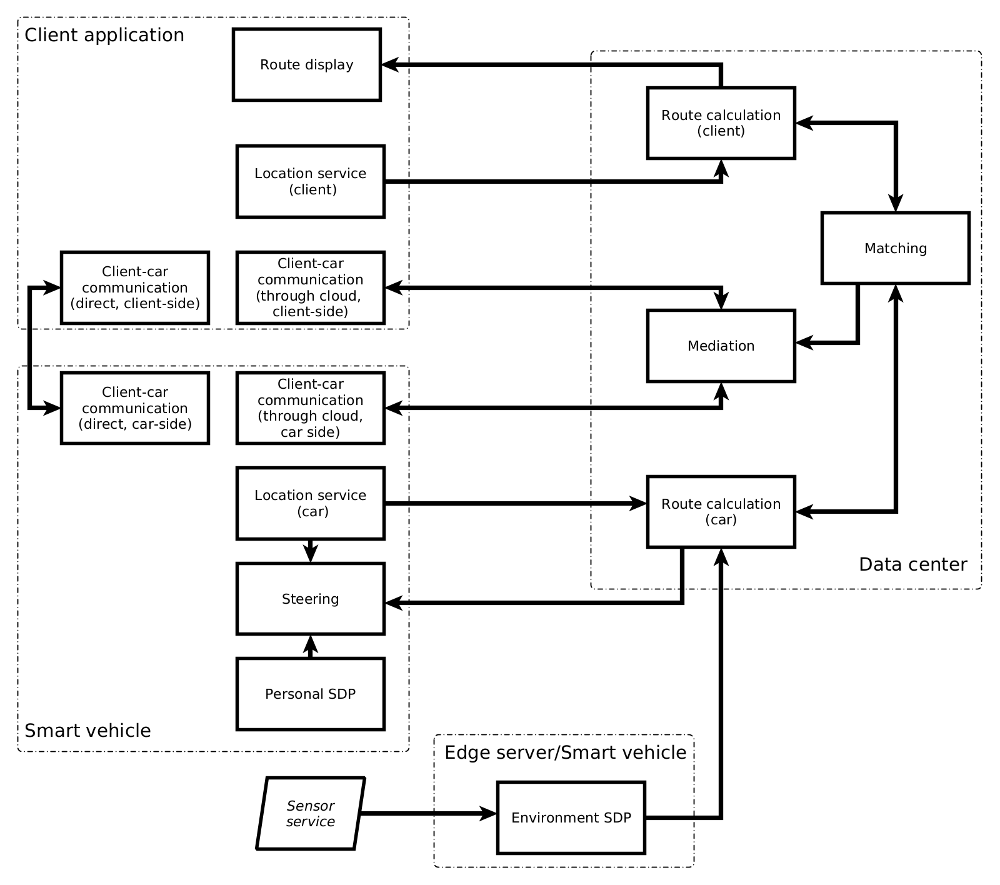

# Towards a Reference Component Model of Edge-Cloud Continuum  
  
This repository contains our work related to a reference component model for Edge-Cloud Continuum. The `data` directory contains the data from our literature study that was used as a foundation for the concepts and ideas that we put into our component model. The `model` directory contains the YAML files that show an example of usage of that model. The development of the model and the related tools is still ongoing. Thus, the example here is meant primarily to show the usage of the core concepts of the model.
  
### Data  
  
The data from our literature study can be found in the `data` directory. The data are split into two files. The `Categories` file lists the clusters of ECC-related terms (and individual terms that do not belong to any cluster) identified in the studied papers, along the total number of occurrences of terms from that cluster.  The `Papers` file contains a table of all studied papers, along with the key terms identified in each of them. Then, for each paper, it lists the identifying numbers of categories/clusters (from the `Categories` table) to which these terms belong.
  
### Model example  

##### Example description

Our model example presents a smart city scenario, where an end user with a smartphone wants to find a route from their current location to a certain point within the city. The user uses a route planning application, which accesses cloud services running on local edge servers and/or a central data center to calculate the route. The user may choose to use a smart vehicle (SV) to get to their destination, which they can access through a car sharing application. Once the user enters a car, it offloads its location service the SV and receives the related data from it.

In the urban environment, the SV relies on cloud services running in local edge nodes, which gather and process data from millions of sensors located throughout the city. In this case, the SV only processes data from its own onboard sensors, while higher-level calculations regarding the route and traffic conditions based on data from thousands of additional sources are offloaded to the local edge servers. Outside of the urban environment, where there are much fewer sources of information and a less reliable network connection, the SV performs those calculations on its local hardware.

The centralized parts of the route-planning application (such as client-car matching) are handled by the cloud services that may not be located anywhere close to the end user.

##### Example files

The files located in the `model` directory describe the entities involved in the running example. Each of those files contains specifications of entities of one of the four types - hardware nodes, software components, application functionalities, and networks. The individual entities are explained in the comments within those files.

##### Functionality diagram

The functionalities described in the `model/functionalities.yaml` file are connected into a directed graph by their inputs and outputs. The figure below illustrates those relationships and shows a high-level picture of the functional architecture of the model example. The arrows on the picture represent the directions of the input/output connections, some of which are used for the control flow and some for the data flow. 
  
